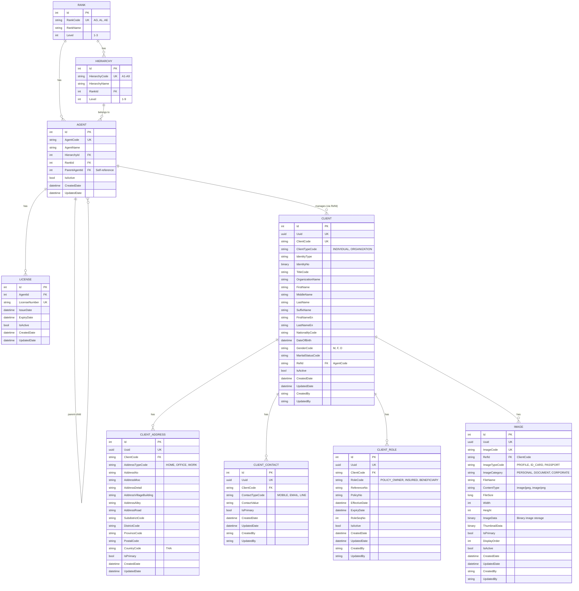

# Entity-Relationship Diagram (ERD)

## Database: Agent Hierarchy Management System

---

## 📊 ER Diagram (Mermaid)



---

## 🔗 Relationships Summary

### Agent Module Relationships

| Parent Table | Child Table | Relationship | Foreign Key | Description |
|-------------|-------------|--------------|-------------|-------------|
| RANK | HIERARCHY | 1:N | RankId | หนึ่ง Rank มีหลาย Hierarchy |
| RANK | AGENT | 1:N | RankId | หนึ่ง Rank มีหลาย Agent |
| HIERARCHY | AGENT | 1:N | HierarchyId | หนึ่ง Hierarchy มีหลาย Agent |
| AGENT | AGENT | 1:N (Self) | ParentAgentId | Agent มี Agent ลูก (Self-referencing) |
| AGENT | LICENSE | 1:N | AgentId | หนึ่ง Agent มีหลาย License |
| AGENT | CLIENT | 1:N | RefId (AgentCode) | หนึ่ง Agent ดูแลหลาย Client |

### Client Module Relationships

| Parent Table | Child Table | Relationship | Foreign Key | Description |
|-------------|-------------|--------------|-------------|-------------|
| CLIENT | CLIENT_ADDRESS | 1:N | ClientCode | หนึ่ง Client มีหลาย Address |
| CLIENT | CLIENT_CONTACT | 1:N | ClientCode | หนึ่ง Client มีหลาย Contact |
| CLIENT | CLIENT_ROLE | 1:N | ClientCode | หนึ่ง Client มีหลาย Role |
| CLIENT | IMAGE | 1:N | RefId (ClientCode) | หนึ่ง Client มีหลาย Image |

---

## 📋 Table Details

### 1. RANK (T_RANK)
**Purpose:** กำหนดระดับตำแหน่งของ Agent

| Column | Type | Constraints | Description |
|--------|------|-------------|-------------|
| Id | INT | PK, AUTO_INCREMENT | Primary Key |
| RankCode | VARCHAR(10) | UNIQUE, NOT NULL | รหัสยศ (AG, AL, AE) |
| RankName | VARCHAR(100) | NOT NULL | ชื่อยศ |
| Level | INT | NOT NULL | ระดับ (1=AG, 2=AL, 3=AE) |

**Sample Data:**
- AG (Agent General) - Level 1
- AL (Agent Leader) - Level 2
- AE (Agent Executive) - Level 3

---

### 2. HIERARCHY (T_HIERARCHY)
**Purpose:** กำหนดระดับลำดับชั้นของ Agent (A1-A9)

| Column | Type | Constraints | Description |
|--------|------|-------------|-------------|
| Id | INT | PK, AUTO_INCREMENT | Primary Key |
| HierarchyCode | VARCHAR(10) | UNIQUE, NOT NULL | รหัสลำดับชั้น (A1-A9) |
| HierarchyName | VARCHAR(100) | NOT NULL | ชื่อลำดับชั้น |
| RankId | INT | FK → RANK(Id) | อ้างอิง Rank |
| Level | INT | NOT NULL | ระดับลำดับชั้น (1-9) |

**Hierarchy Structure:**
```
A9 (Level 9, AE) ← Top
└─ A8 (Level 8, AE)
   └─ A7 (Level 7, AE)
      └─ A6 (Level 6, AL)
         └─ A5 (Level 5, AL)
            └─ A4 (Level 4, AL)
               └─ A1 (Level 1, AG) ← Bottom
```

---

### 3. AGENT (T_AGENT)
**Purpose:** ข้อมูลตัวแทนประกันภัย

| Column | Type | Constraints | Description |
|--------|------|-------------|-------------|
| Id | INT | PK, AUTO_INCREMENT | Primary Key |
| AgentCode | VARCHAR(20) | UNIQUE, NOT NULL | รหัสตัวแทน |
| AgentName | VARCHAR(200) | NOT NULL | ชื่อตัวแทน |
| HierarchyId | INT | FK → HIERARCHY(Id) | อ้างอิง Hierarchy |
| RankId | INT | FK → RANK(Id) | อ้างอิง Rank |
| ParentAgentId | INT | FK → AGENT(Id), NULL | อ้างอิงตัวแทนแม่ (Self-reference) |
| IsActive | BOOLEAN | DEFAULT TRUE | สถานะใช้งาน |
| CreatedDate | TIMESTAMP | NOT NULL | วันที่สร้าง |
| UpdatedDate | TIMESTAMP | NOT NULL | วันที่แก้ไข |

**Self-Referencing:**
- ParentAgentId → Agent.Id (ตัวแทนแม่)
- ChildAgents ← Collection of Agents (ตัวแทนลูก)

---

### 4. LICENSE (T_LICENSE)
**Purpose:** ใบอนุญาตของตัวแทน

| Column | Type | Constraints | Description |
|--------|------|-------------|-------------|
| Id | INT | PK, AUTO_INCREMENT | Primary Key |
| AgentId | INT | FK → AGENT(Id) | อ้างอิง Agent |
| LicenseNumber | VARCHAR(50) | UNIQUE, NOT NULL | หมายเลขใบอนุญาต |
| IssueDate | DATE | NOT NULL | วันที่ออก |
| ExpiryDate | DATE | NULL | วันที่หมดอายุ |
| IsActive | BOOLEAN | DEFAULT TRUE | สถานะใช้งาน |
| CreatedDate | TIMESTAMP | NOT NULL | วันที่สร้าง |
| UpdatedDate | TIMESTAMP | NOT NULL | วันที่แก้ไข |

---

### 5. CLIENT (T_CLIENT)
**Purpose:** ข้อมูลลูกค้า (บุคคล/นิติบุคคล)

| Column | Type | Constraints | Description |
|--------|------|-------------|-------------|
| Id | INT | PK, AUTO_INCREMENT | Primary Key |
| Uuid | UUID | UNIQUE, NOT NULL | Unique Identifier |
| ClientCode | VARCHAR(20) | UNIQUE, NOT NULL | รหัสลูกค้า |
| ClientTypeCode | VARCHAR(20) | NULL | ประเภท (INDIVIDUAL, ORGANIZATION) |
| FirstName | VARCHAR(100) | NULL | ชื่อ |
| LastName | VARCHAR(100) | NULL | นามสกุล |
| OrganizationName | VARCHAR(200) | NULL | ชื่อองค์กร |
| DateOfBirth | DATE | NULL | วันเกิด |
| GenderCode | VARCHAR(1) | NULL | เพศ (M, F, O) |
| NationalityCode | VARCHAR(3) | NULL | สัญชาติ (THA, USA) |
| RefId | VARCHAR(20) | FK → AGENT(AgentCode) | รหัสตัวแทนที่ดูแล |
| IsActive | BOOLEAN | DEFAULT TRUE | สถานะใช้งาน |
| CreatedDate | TIMESTAMP | NOT NULL | วันที่สร้าง |
| UpdatedDate | TIMESTAMP | NOT NULL | วันที่แก้ไข |
| CreatedBy | VARCHAR(100) | NULL | ผู้สร้าง |
| UpdatedBy | VARCHAR(100) | NULL | ผู้แก้ไข |

**Note:** มีฟิลด์อื่นๆ อีกมากมายสำหรับข้อมูลส่วนบุคคล, อาชีพ, รายได้

---

### 6. CLIENT_ADDRESS (T_CLIENT_ADDRESS)
**Purpose:** ที่อยู่ของลูกค้า

| Column | Type | Constraints | Description |
|--------|------|-------------|-------------|
| Id | INT | PK, AUTO_INCREMENT | Primary Key |
| Uuid | UUID | UNIQUE, NOT NULL | Unique Identifier |
| ClientCode | VARCHAR(20) | FK → CLIENT(ClientCode) | อ้างอิง Client |
| AddressTypeCode | VARCHAR(20) | NULL | ประเภท (HOME, OFFICE, WORK) |
| AddressNo | VARCHAR(50) | NULL | บ้านเลขที่ |
| AddressMoo | VARCHAR(10) | NULL | หมู่ |
| AddressDetail | VARCHAR(200) | NULL | รายละเอียด |
| AddressRoad | VARCHAR(100) | NULL | ถนน |
| SubdistrictCode | VARCHAR(10) | NOT NULL | รหัสตำบล |
| DistrictCode | VARCHAR(10) | NOT NULL | รหัสอำเภอ |
| ProvinceCode | VARCHAR(10) | NOT NULL | รหัสจังหวัด |
| PostalCode | VARCHAR(10) | NOT NULL | รหัสไปรษณีย์ |
| CountryCode | VARCHAR(3) | DEFAULT 'THA' | รหัสประเทศ |
| IsPrimary | BOOLEAN | DEFAULT FALSE | ที่อยู่หลัก |
| CreatedDate | TIMESTAMP | NOT NULL | วันที่สร้าง |
| UpdatedDate | TIMESTAMP | NOT NULL | วันที่แก้ไข |

---

### 7. CLIENT_CONTACT (T_CLIENT_CONTACT)
**Purpose:** ช่องทางติดต่อลูกค้า

| Column | Type | Constraints | Description |
|--------|------|-------------|-------------|
| Id | INT | PK, AUTO_INCREMENT | Primary Key |
| Uuid | UUID | UNIQUE, NOT NULL | Unique Identifier |
| ClientCode | VARCHAR(20) | FK → CLIENT(ClientCode) | อ้างอิง Client |
| ContactTypeCode | VARCHAR(20) | NULL | ประเภท (MOBILE, EMAIL, LINE) |
| ContactValue | VARCHAR(200) | NOT NULL | ค่าติดต่อ |
| IsPrimary | BOOLEAN | DEFAULT FALSE | ติดต่อหลัก |
| CreatedDate | TIMESTAMP | NOT NULL | วันที่สร้าง |
| UpdatedDate | TIMESTAMP | NOT NULL | วันที่แก้ไข |
| CreatedBy | VARCHAR(100) | NOT NULL | ผู้สร้าง |
| UpdatedBy | VARCHAR(100) | NOT NULL | ผู้แก้ไข |

---

### 8. CLIENT_ROLE (T_CLIENT_ROLE)
**Purpose:** บทบาทของลูกค้าในกรมธรรม์

| Column | Type | Constraints | Description |
|--------|------|-------------|-------------|
| Id | INT | PK, AUTO_INCREMENT | Primary Key |
| Uuid | UUID | UNIQUE, NOT NULL | Unique Identifier |
| ClientCode | VARCHAR(20) | FK → CLIENT(ClientCode) | อ้างอิง Client |
| RoleCode | VARCHAR(50) | NULL | รหัสบทบาท (POLICY_OWNER, INSURED) |
| ReferenceNo | VARCHAR(50) | NULL | รหัสอ้างอิง |
| PolicyNo | VARCHAR(50) | NULL | เลขที่กรมธรรม์ |
| EffectiveDate | DATE | NULL | วันที่เริ่มมีผล |
| ExpiryDate | DATE | NULL | วันที่สิ้นสุด |
| RoleSeqNo | INT | NULL | ลำดับบทบาท |
| IsActive | BOOLEAN | DEFAULT TRUE | สถานะใช้งาน |
| CreatedDate | TIMESTAMP | NOT NULL | วันที่สร้าง |
| UpdatedDate | TIMESTAMP | NOT NULL | วันที่แก้ไข |

**Role Types:**
- POLICY_OWNER - เจ้าของกรมธรรม์
- INSURED - ผู้เอาประกัน
- BENEFICIARY - ผู้รับผลประโยชน์
- PAYOR - ผู้ชำระเบี้ย
- CORPORATE_CLIENT - ลูกค้าองค์กร

---

### 9. IMAGE (T_IMAGE)
**Purpose:** รูปภาพและเอกสารของลูกค้า

| Column | Type | Constraints | Description |
|--------|------|-------------|-------------|
| Id | INT | PK, AUTO_INCREMENT | Primary Key |
| Uuid | UUID | UNIQUE, NOT NULL | Unique Identifier |
| ImageCode | VARCHAR(50) | UNIQUE, NOT NULL | รหัสรูปภาพ |
| RefId | VARCHAR(20) | FK → CLIENT(ClientCode) | อ้างอิง Client |
| ImageTypeCode | VARCHAR(20) | NULL | ประเภท (PROFILE, ID_CARD) |
| ImageCategory | VARCHAR(20) | NULL | หมวดหมู่ (PERSONAL, DOCUMENT) |
| FileName | VARCHAR(200) | NULL | ชื่อไฟล์ |
| ContentType | VARCHAR(50) | NULL | MIME type (image/jpeg) |
| FileSize | BIGINT | NULL | ขนาดไฟล์ (bytes) |
| Width | INT | NULL | ความกว้าง (pixels) |
| Height | INT | NULL | ความสูง (pixels) |
| ImageData | BYTEA | NULL | ข้อมูลรูปภาพ (Binary) |
| ThumbnailData | BYTEA | NULL | ข้อมูล Thumbnail (Binary) |
| IsPrimary | BOOLEAN | DEFAULT FALSE | รูปหลัก |
| DisplayOrder | INT | NULL | ลำดับการแสดงผล |
| IsActive | BOOLEAN | DEFAULT TRUE | สถานะใช้งาน |
| CreatedDate | TIMESTAMP | NOT NULL | วันที่สร้าง |
| UpdatedDate | TIMESTAMP | NOT NULL | วันที่แก้ไข |

**Image Types:**
- PROFILE - รูปโปรไฟล์
- ID_CARD - บัตรประชาชน
- PASSPORT - หนังสือเดินทาง
- COMPANY_LOGO - โลโก้บริษัท
- REGISTRATION - เอกสารจดทะเบียน
- SIGNATURE - ลายเซ็น

---

## 🔑 Foreign Key Constraints

### Agent Module
```sql
-- HIERARCHY references RANK
ALTER TABLE T_HIERARCHY 
    ADD CONSTRAINT FK_HIERARCHY_RANK 
    FOREIGN KEY (RANK_ID) REFERENCES T_RANK(ID);

-- AGENT references HIERARCHY
ALTER TABLE T_AGENT 
    ADD CONSTRAINT FK_AGENT_HIERARCHY 
    FOREIGN KEY (HIERARCHY_ID) REFERENCES T_HIERARCHY(ID);

-- AGENT references RANK
ALTER TABLE T_AGENT 
    ADD CONSTRAINT FK_AGENT_RANK 
    FOREIGN KEY (RANK_ID) REFERENCES T_RANK(ID);

-- AGENT references AGENT (Self-referencing)
ALTER TABLE T_AGENT 
    ADD CONSTRAINT FK_AGENT_PARENT 
    FOREIGN KEY (PARENT_AGENT_ID) REFERENCES T_AGENT(ID);

-- LICENSE references AGENT
ALTER TABLE T_LICENSE 
    ADD CONSTRAINT FK_LICENSE_AGENT 
    FOREIGN KEY (AGENT_ID) REFERENCES T_AGENT(ID);
```

### Client Module
```sql
-- CLIENT references AGENT (via AgentCode)
ALTER TABLE T_CLIENT 
    ADD CONSTRAINT FK_CLIENT_AGENT 
    FOREIGN KEY (REF_ID) REFERENCES T_AGENT(AGENT_CODE);

-- CLIENT_ADDRESS references CLIENT
ALTER TABLE T_CLIENT_ADDRESS 
    ADD CONSTRAINT FK_ADDRESS_CLIENT 
    FOREIGN KEY (CLIENT_CODE) REFERENCES T_CLIENT(CLIENT_CODE);

-- CLIENT_CONTACT references CLIENT
ALTER TABLE T_CLIENT_CONTACT 
    ADD CONSTRAINT FK_CONTACT_CLIENT 
    FOREIGN KEY (CLIENT_CODE) REFERENCES T_CLIENT(CLIENT_CODE);

-- CLIENT_ROLE references CLIENT
ALTER TABLE T_CLIENT_ROLE 
    ADD CONSTRAINT FK_ROLE_CLIENT 
    FOREIGN KEY (CLIENT_CODE) REFERENCES T_CLIENT(CLIENT_CODE);

-- IMAGE references CLIENT
ALTER TABLE T_IMAGE 
    ADD CONSTRAINT FK_IMAGE_CLIENT 
    FOREIGN KEY (REF_ID) REFERENCES T_CLIENT(CLIENT_CODE);
```

---

## 📊 Cardinality Summary

| Relationship | Cardinality | Description |
|--------------|-------------|-------------|
| RANK → HIERARCHY | 1:N | One Rank has many Hierarchies |
| RANK → AGENT | 1:N | One Rank has many Agents |
| HIERARCHY → AGENT | 1:N | One Hierarchy has many Agents |
| AGENT → AGENT | 1:N | One Agent (parent) has many Agents (children) |
| AGENT → LICENSE | 1:N | One Agent has many Licenses |
| AGENT → CLIENT | 1:N | One Agent manages many Clients |
| CLIENT → CLIENT_ADDRESS | 1:N | One Client has many Addresses |
| CLIENT → CLIENT_CONTACT | 1:N | One Client has many Contacts |
| CLIENT → CLIENT_ROLE | 1:N | One Client has many Roles |
| CLIENT → IMAGE | 1:N | One Client has many Images |

---

## 🎯 Business Rules

### Agent Hierarchy Rules
1. **Rank Levels:** AG (1) < AL (2) < AE (3)
2. **Hierarchy Levels:** A1 (1) < A4-A6 (4-6) < A7-A9 (7-9)
3. **Parent Validation:** Child agent rank must be lower than parent rank
4. **Top Level:** AE agents (A7-A9) can have null ParentAgentId
5. **AgentCode:** Must be unique across all agents

### Client Rules
1. **ClientCode:** Must be unique
2. **ClientType:** INDIVIDUAL requires FirstName/LastName, ORGANIZATION requires OrganizationName
3. **RefId (AgentCode):** Must exist in AGENT table
4. **Primary Flags:** Each client should have at most one primary address and one primary contact

### Image Rules
1. **ImageCode:** Must be unique
2. **RefId (ClientCode):** Must exist in CLIENT table
3. **Binary Storage:** ImageData and ThumbnailData stored as BYTEA in PostgreSQL
4. **API Conversion:** Binary data converted to base64 for API responses

---

## 📈 Indexes Recommendations

```sql
-- Agent Module Indexes
CREATE INDEX idx_agent_code ON T_AGENT(AGENT_CODE);
CREATE INDEX idx_agent_hierarchy ON T_AGENT(HIERARCHY_ID);
CREATE INDEX idx_agent_rank ON T_AGENT(RANK_ID);
CREATE INDEX idx_agent_parent ON T_AGENT(PARENT_AGENT_ID);
CREATE INDEX idx_license_agent ON T_LICENSE(AGENT_ID);

-- Client Module Indexes
CREATE INDEX idx_client_code ON T_CLIENT(CLIENT_CODE);
CREATE INDEX idx_client_refid ON T_CLIENT(REF_ID);
CREATE INDEX idx_client_type ON T_CLIENT(CLIENT_TYPE_CODE);
CREATE INDEX idx_address_client ON T_CLIENT_ADDRESS(CLIENT_CODE);
CREATE INDEX idx_contact_client ON T_CLIENT_CONTACT(CLIENT_CODE);
CREATE INDEX idx_role_client ON T_CLIENT_ROLE(CLIENT_CODE);
CREATE INDEX idx_image_refid ON T_IMAGE(REF_ID);
CREATE INDEX idx_image_code ON T_IMAGE(IMAGE_CODE);
```

---

## 🔄 Cascade Rules

### Delete Behavior
- **AGENT → LICENSE:** CASCADE (delete licenses when agent is deleted)
- **AGENT → CLIENT:** RESTRICT (cannot delete agent with clients)
- **CLIENT → ADDRESS/CONTACT/ROLE/IMAGE:** CASCADE (delete related data when client is deleted)

### Update Behavior
- **AgentCode Change:** CASCADE to CLIENT.RefId
- **ClientCode Change:** CASCADE to ADDRESS, CONTACT, ROLE, IMAGE

---

**Document Version:** 1.0  
**Last Updated:** November 10, 2025  
**Database:** PostgreSQL  
**ORM:** Entity Framework Core 6.0.25
